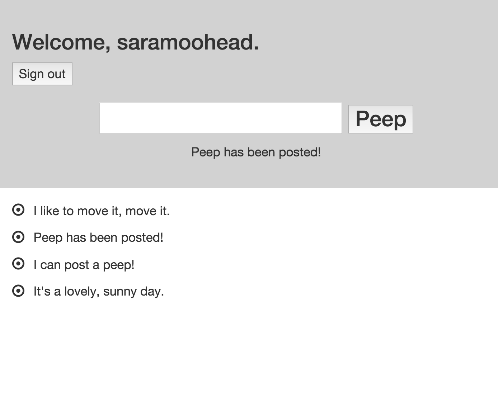

Summary
=================

The first weekend challenge I was able to complete by Monday morning with a working system - and my first course sticker! 

Test driven through Cucumber to RSpec and using the Sinatra framework, the system allows users tp sign up, sign in and sign out. They sign in to post peeps and can view all peeps without signing in.

In coming back to layer in CSS, I've refactored the partials to be much more logically organised and added logic to the partial displays. For example, the user management segements were all over the place, but are now pulled together in a user management partial. The new user page turns off the main user management partial.




Technologies Used
=================

Ruby, Sinatra, DataMapper, Cucumber, Capybara, RSpec, RackFlash


User stories provided:
-------

```
As a Maker
So that I can post messages on Chitter as me
I want to sign up for Chitter

As a Maker
So that I can post messages on Chitter as me
I want to log in to Chitter

As a Maker
So that I can avoid others posting messages on Chitter as me
I want to log out of Chitter

As a maker
So that I can let people know what I am doing  
I want to post a message (peep) to chitter

As a maker
So that I can see what others are saying  
I want to see all peeps in reverse chronological order
```

